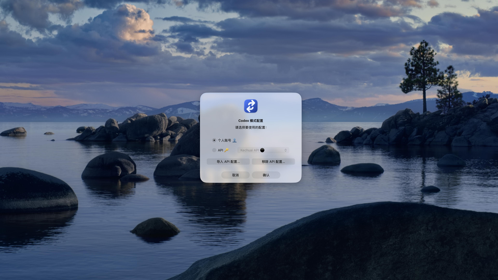
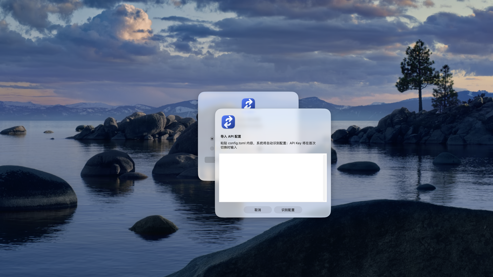
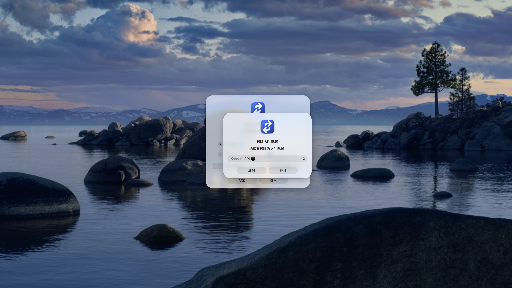

# Codex Mode Switcher

  <a href="./README.md">简体中文</a> | <a href="./README.en.md">English</a>

  <a href="https://github.com/charleszrz/codex-mode-switcher/releases/tag/v0.1.0-alpha.2">Download pre-release</a> ·
  <a href="./docs/USAGE.md">Usage</a> ·
  <a href="./PRIVACY.md">Privacy</a> ·
  <a href="./SECURITY.md">Security</a>

A **local configuration switcher** for Codex desktop that keeps credentials and privacy as the primary boundary when moving between account and API configurations.

> This is a public Alpha pre-release. Back up your own device before using it in your only working environment. This project is not affiliated with, sponsored by, or endorsed by OpenAI.

## What it solves

Account and API use of Codex often require different settings. Manual switching can accidentally commit a key, overwrite account configuration, or leave API authentication behind when returning to an account.

Codex Mode Switcher makes the operation local, previewable, verifiable, and rollback-capable:

- import an API configuration template **without a secret**;
- enter an API key once, only when activating API mode, and write it only to Codex's active authentication location;
- remove active API authentication and restore captured non-authentication settings when returning to account mode;
- preview changes, make the smallest necessary backup, write atomically, and roll back on failure.

## Privacy boundary

| The project does | The project never does |
| --- | --- |
| Stores credential-free configuration templates locally | Uploads configuration, telemetry, analytics, cloud sync, or automatic updates |
| Writes a one-time API key to Codex's active authentication location when you activate API mode | Retains, backs up, or restores an API key |
| Stores only non-authentication account settings that you explicitly capture | Reads, exports, copies, or restores ChatGPT / OAuth login state |
| Rolls back this operation's file changes when it fails | Commits credentials, backups, logs, or machine paths |

This project cannot control how a third-party API provider retains request data. Review that provider's privacy and retention policy before use.

## Support status

| Platform | Alpha package | Signing status |
| --- | --- | --- |
| macOS | Available | Unsigned and not notarized |
| Windows | Available | Unsigned |
| Linux | Available | Not applicable |

Pre-release packages contain an isolated runtime, so end users do not need to install or upgrade their system Python. macOS and Windows will show safety warnings for the current unsigned applications; that is a known release state, not a warning to ignore. Prefer source installation or wait for a signed stable release.

## Quick start

1. Download the package for your system from [v0.1.0-alpha.2](https://github.com/charleszrz/codex-mode-switcher/releases/tag/v0.1.0-alpha.2).
2. Unzip and start the application. Before first use, back up your Codex configuration using your normal device-backup process.
3. Fully close Codex.
4. Capture account configuration once, import a credential-free API TOML profile, then choose **Preview selected**.
5. Confirm the preview, choose **Activate selected API**, and enter the API key in the one-time dialog.
6. To return to an account, fully close Codex, choose **Return to account**, then sign in directly in Codex.

See the full [English usage guide](./docs/USAGE.md) for source installation and local-state removal.

## Interface preview

  
  
  

From left to right: choose the profile to activate, import an API template without an API key, and remove a locally saved template. The screenshots contain no API keys or login authentication.

## For contributors

- Development requires Python 3.11 or later. Run `python -m pip install .`, then `codex-mode-switcher gui`.
- Never put keys, tokens, account-authentication files, backups, or machine-specific absolute paths into Issues, screenshots, logs, examples, or commits.
- Run `scripts/audit-release.sh` before contributing. CI tests and audits release contents on macOS, Windows, and Linux with Python 3.11/3.12.

Read the normative [Security policy](./SECURITY.md), [Threat model](./THREAT_MODEL.md), and [Privacy notice](./PRIVACY.md).

## License

[MIT License](./LICENSE).
