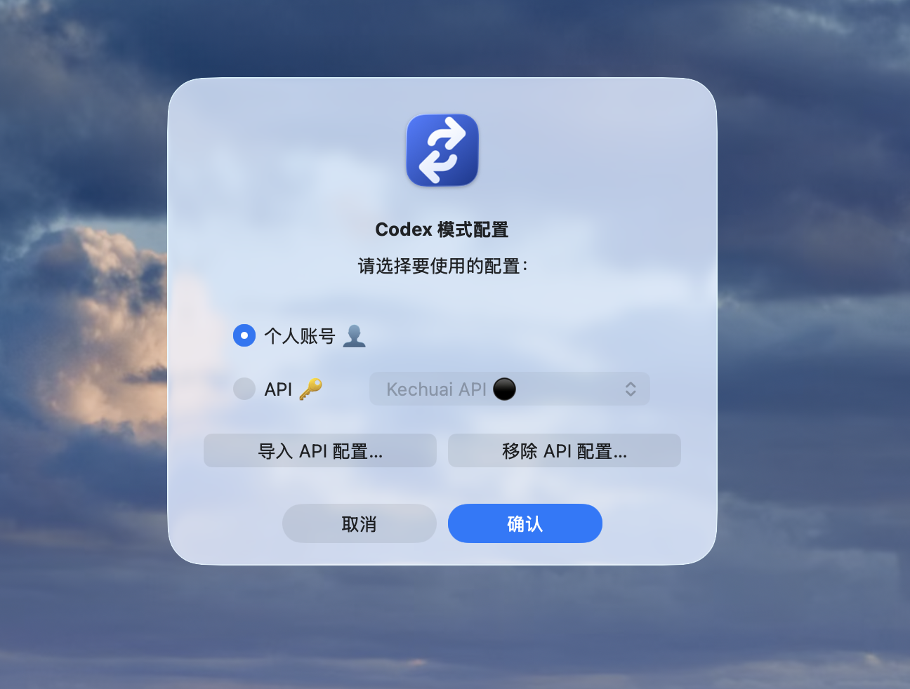
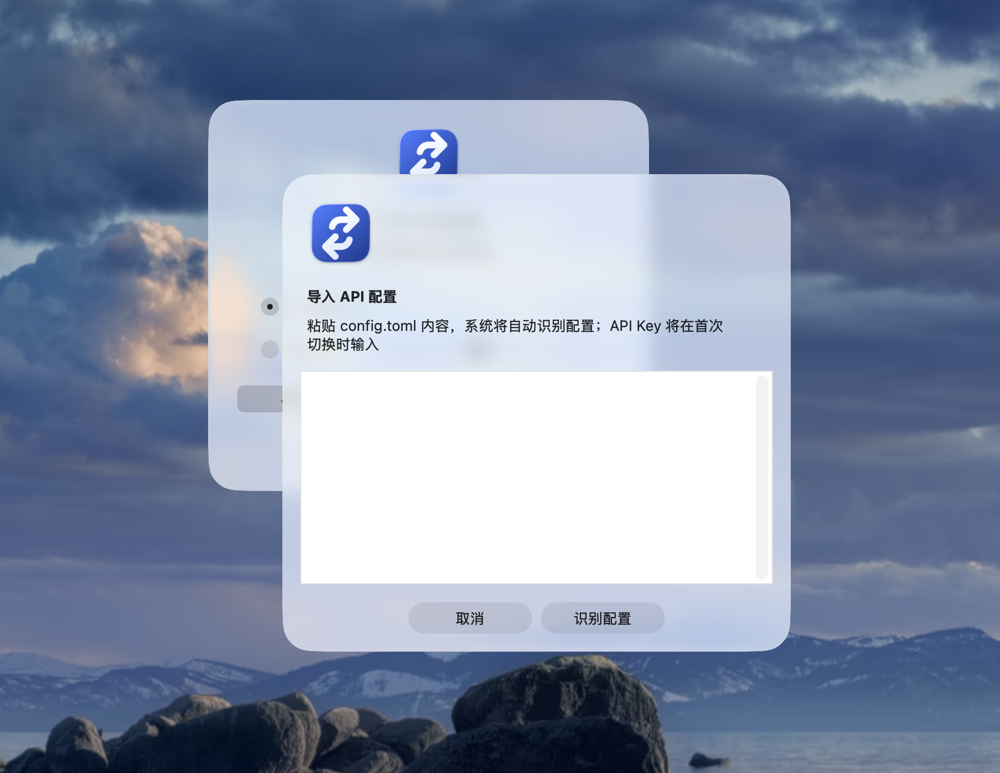
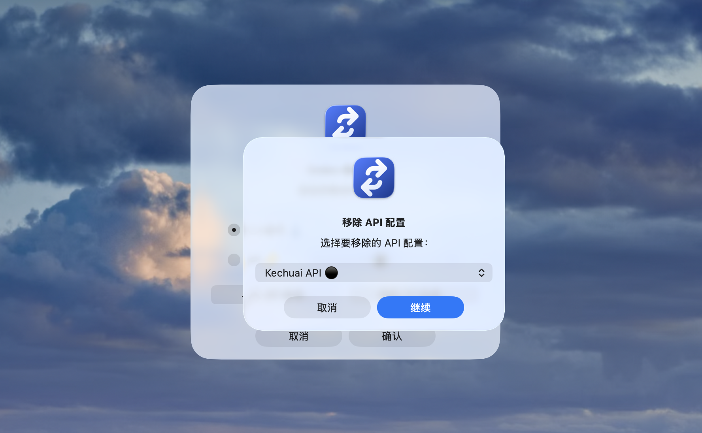

# Codex Mode Switcher

  <a href="https://charleszrz.github.io/codex-mode-switcher/">打开中英双语介绍页</a> ·
  <a href="./README.en.md">English README</a>

  <a href="https://github.com/charleszrz/codex-mode-switcher/releases/tag/v0.1.0-alpha.2">下载预发布版本</a> ·
  <a href="./docs/使用说明.md">使用说明</a> ·
  <a href="./PRIVACY.md">隐私说明（English）</a> ·
  <a href="./SECURITY.md">安全策略（English）</a>

一个面向 Codex 桌面端的**本地配置切换工具**：在个人账号配置与 API 配置之间切换，同时把认证数据、API Key 与你的隐私放在第一位。

> 当前为公开 Alpha 预发布版，尚不适合在唯一工作环境中未经备份直接使用。本项目与 OpenAI 没有从属、赞助或官方背书关系。

## 它解决什么问题

Codex 的个人账号模式和 API 模式往往需要不同配置。手工修改时，很容易误提交密钥、覆盖自己的账号配置，或在切回账号时留下 API 认证数据。

Codex Mode Switcher 把这件事收敛为可预览、可验证、可回滚的本地操作：

- 导入**不含密钥**的 API 配置模板；
- 一次性输入 API Key，仅在启用 API 的当下写入 Codex 的活动认证位置；
- 返回账号模式时删除活动 API 认证，并恢复已保存的非认证配置；
- 在写入前预览、必要时做最小备份、原子写入，失败时回滚。

## 隐私边界

| 本项目会做 | 本项目绝不会做 |
| --- | --- |
| 在本机保存不含认证信息的配置模板 | 上传配置、遥测、分析、云同步或自动更新 |
| 在你确认启用 API 时把一次性输入的 Key 写入 Codex 当前认证位置 | 保存、备份或恢复 API Key |
| 保存你主动捕获的**非认证**账号配置 | 读取、导出、复制或恢复 ChatGPT / OAuth 登录状态 |
| 操作失败时回滚本次文件变更 | 将凭据、备份、日志、机器路径提交到仓库 |

第三方 API 提供商如何处理请求数据不由本项目控制；使用前请自行阅读相应提供商的隐私与数据保留政策。

## 支持情况

| 平台 | Alpha 构建产物 | 签名状态 |
| --- | --- | --- |
| macOS | 有 | 未签名、未公证 |
| Windows | 有 | 未签名 |
| Linux | 有 | 不适用 |

预发布包使用独立运行时；最终用户不需要安装或升级系统自带的 Python。macOS 和 Windows 当前会给未签名应用安全提示，这是已知发布状态，不是可以忽略的安全警告。请优先阅读源码，或等待签名稳定版。

## 快速开始

1. 从 [v0.1.0-alpha.2](https://github.com/charleszrz/codex-mode-switcher/releases/tag/v0.1.0-alpha.2) 下载与你系统对应的包。
2. 解压后启动应用；首次使用前，请用你日常的设备备份方式备份 Codex 配置。
3. 完全退出 Codex。
4. 先使用“保存账号配置”，再导入不含凭据的 API TOML 配置，并选择“预览所选项”。
5. 确认预览后，选择“启用所选 API”，在一次性对话框中输入 API Key。
6. 要返回个人账号时，完全退出 Codex，选择“返回账号”，随后直接在 Codex 内登录。

完整步骤、源码安装和本机数据清理，请看 [中文使用说明](./docs/使用说明.md)。

## 界面预览

  
  
  

从左到右：选择要启用的配置、导入不含 API Key 的配置模板、移除本机保存的配置模板。截图不包含 API Key 或登录认证信息。

## 面向贡献者

- 开发环境要求 Python 3.11 以上；运行 `python -m pip install .` 后使用 `codex-mode-switcher gui`。
- 不要在 Issue、截图、日志、配置示例或提交记录中粘贴 Key、Token、账号认证文件、备份或机器绝对路径。
- 提交前运行 `scripts/audit-release.sh`；CI 会在 macOS、Windows、Linux 上以 Python 3.11/3.12 测试并审计发布内容。

请先阅读 [安全策略](./SECURITY.md)、[威胁模型](./THREAT_MODEL.md) 与 [隐私说明](./PRIVACY.md)（当前均为英文规范文本）。

## 许可证

[MIT License](./LICENSE)。
